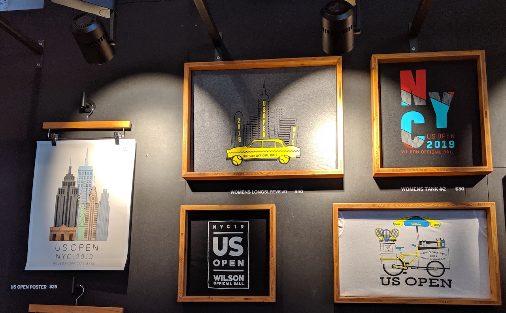
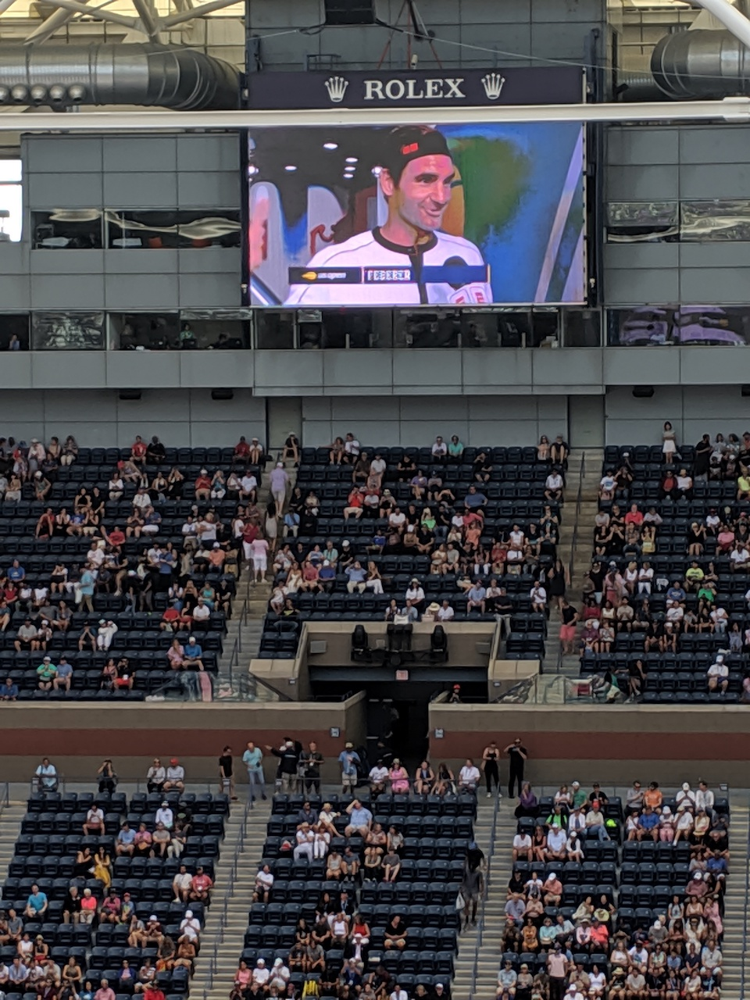
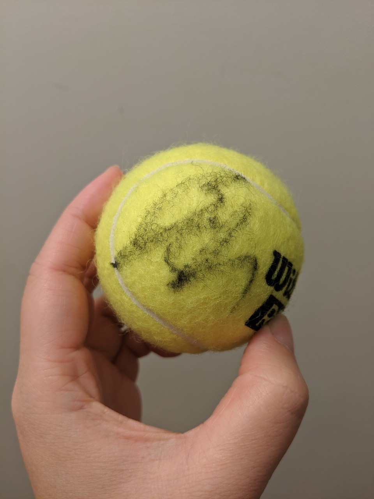

今年剛好在紐約有機會去看四大公開賽之一的us open，趁著費爸退休前一定要看到一場他的比賽！這次老天眷顧超幸運的剛好買到費爸和小威的場次，賽程出來後感覺真的跟中樂透一樣，嘴巴都笑得合不起來。

<figure>
    
</figure>

### 大滿貫小科普
大滿貫(The Grand Slam tournaments)是職業網球賽事中四個最重要，積分和獎金最多的比賽，每個比賽的場地也不同，包含：
- 一月中的澳網 Australian Open - 硬地
- 六月的法網 French Open - 紅土
- 七月的溫網 Wimbledon - 草地
- 九月的美網 US Open - 硬地

這次去的就是在紐約舉辦的美網拉～
<figure>
    
    <figcaption>Arthur Ashe Stadium</figcaption>
</figure>

### 美網

2019/08/19 - 2019/09/08

美國人真的滿熱衷各個球賽的，球賽都弄得很熱鬧，比賽前一個禮拜還有免費的fan week，有很多小活動XD，當天還有很多紀念品店，各種贊助，像賓士就投了很多錢，Grey Goose還特別出了us open版本的酒
<figure class="half">
    
    <figcaption>Honey Deuce Grey Goose</figcaption>
</figure>

*~~How to make Honey Deuce~~*

- *1.5 parts Grey Goose vodka*
- *3 parts fresh lemonade*
- *½ part Premium Raspberry Liqueur*
- *3 honeydew melon balls for garnish*

<figure class="half">
    
    
    <figcaption>Arthur Ashe Stadium / Louis Armstrong </figcaption>
</figure>

<figure class="half">
    
    
    <figcaption>Grandstand / 周邊球場</figcaption>
</figure>

### 交通

美網的球場叫做USTA Billie Jean King National Tennis Center，位於皇后區的法拉盛(Flushing)，交通非常方便，開車，地鐵，火車都能到達！

- 自駕：直接開到球場，比賽期間都會有工作人員和指標，會安排停到對面大都會棒球場的停車場，一天$25。
- 地鐵(MTA)：地鐵7號線到`Mets - Willets Point`，一出站就會看到球場了。紐約地鐵單趟$2.75，不計里程。
- 火車(LIRR)：Port Washington Line到`Mets - Willets Point`，也是一出站就到了。火車票價$6(off peak)/$9(peak)。

### 購票
購票就是最艱難的事了，美網的購票方式像一場賭博，你不知道你買的那場會是誰，如果等賽程出來再買會有風險，可能有沒票或是很貴，先買後面的話也可能喜歡的球星挺不到決賽，買票前要三思啊！但是大絕招還是跟著福星買票，強運最重要！哈哈哈

在官網上買票會連到ticketmaster，美網的票很有趣，是可以透過ticketmaster轉賣的。
票種很多，如果打算看很多天的話也有不同的ticket plan可以買，例如：主球場Full Series, Holiday Weekend(正逢美國Labor Day), Championship Week...etc. 更多請上[官網Ticket Plans](https://www.usopen.org/en_US/tickets/ticket_plans.html)

單天的話票種有四種：
- Arthur Ashe Stadium（主球場）
- Louis Armstrong（第二球場）
- Grandstand（第三球場）

> 以上球場又分成白天場和晚場，對號入座

- General Admission（第一個禮拜）
    - 不能進主球場但可以看二三球場的比賽，開放給GA的位置先搶先贏

這次買了第三輪的GA票($123)和16強的Arthur Ashe Stadium白天場($181)，大噴血，但買的很值得～球星沒意外都會在主球場，但場次就真的要靠運氣了，主場一個session通常是一個男單+女單。

<figure class="half">
    
    <figcaption>費爸！！</figcaption>
</figure>

還有一個小插曲，球員如果有練球時間也會公布，這次幸運看到Djokovic練球，雖然他最後因傷退賽。總之，今年美網很好玩，看了都想打網球了！只差今年冠軍Nadal沒看到了。

<figure class="half">
    
    <figcaption>詹詠然簽名球</figcaption>
</figure>

> 看比賽前還回顧了一下網球王子，回憶的過去啊～～
>
> 某W:你在看美網前看這種高水準的會不會覺得美網很弱
