> 龍蝦之旅 -- 初訪波士頓

9/14-9/15 期待很久的波士頓2天一夜！

## 交通 (NYC <-> Boston)

紐約到波士頓很方便有長途巴士可以搭，美國比較常見的巴士就是Greyhound 和 Megabus，票價大約$20上下，但這次跟朋友一起開車去，車程大約四個半小時，所以其實這次在波士頓時間也很短暫，必須要二訪才行哈哈。

## 住宿

這次住在Hampton Inn and Suites Boston/Waltham，因為市區的住宿都巨貴，剛好這次開車去就選了一個離 Boston Downtown 20分鐘車程的地方，飯店很新住起來很舒服，早餐也滿多選項的！讚讚

## 波士頓小簡介

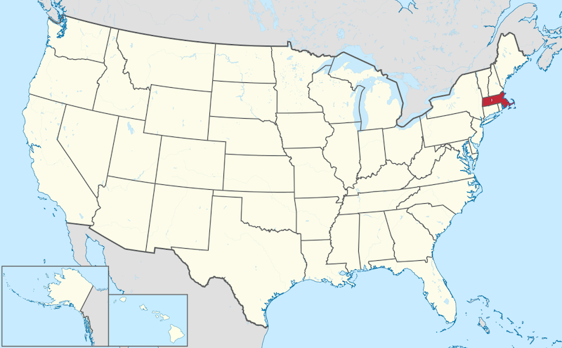{: .align-left} 波士頓為麻薩諸塞州（麻州）的最大城，也是新英倫區（New England）人口最多的城市，波士頓很小，佔地只有232.1平方公里，卻有高達69萬居民，人口密度很高，但還是不及台北和曼哈頓哈哈。

> 美國的東北區又被稱作New England 地區，包含了六個州： Maine, Vermont, New Hampshire, Massachusetts, Rhode Island, 和 Connecticut

波士頓蘊含許多歷史故事，是美國最古老的城市之一，1630年，由英國的清教徒移民（Puritan）建立，歷史課本學到的一些美國獨立戰爭就是在波士頓爆發的：
- 波士頓大屠殺 (Boston Massacre)
- 波士頓傾茶事件 (Boston Tea Party)
- 邦克山戰役 (Battle of Bunker Hill)
- 波士頓之圍 (Siege of Boston)

喜歡歷史的人一定要來波士頓走一趟"自由之路"！

## 自由之路（Freedom Trail）

全長共 2.5 mile(4km)，經過16個歷史景點，跟著紅磚走就對了！
這次礙於時間因素只去了三個，太可惜了。

<figure class="half">
    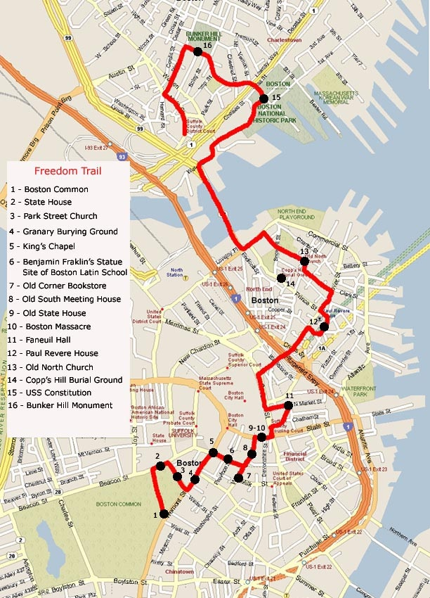
    <figcaption>https://site.ieee.org/pes-gm/2016/07/01/the-freedom-trail/</figcaption>
</figure>

- Boston Common 建於1634年，是全美第一座公園，自由之路的起點。
- Massachusetts State House 麻州議會大廈，這塊土地曾經屬於第一任州長John Hancock所有，他是美國開國元老之一，也是第一位在獨立宣言上簽字的人。
<figure class="half">
    
    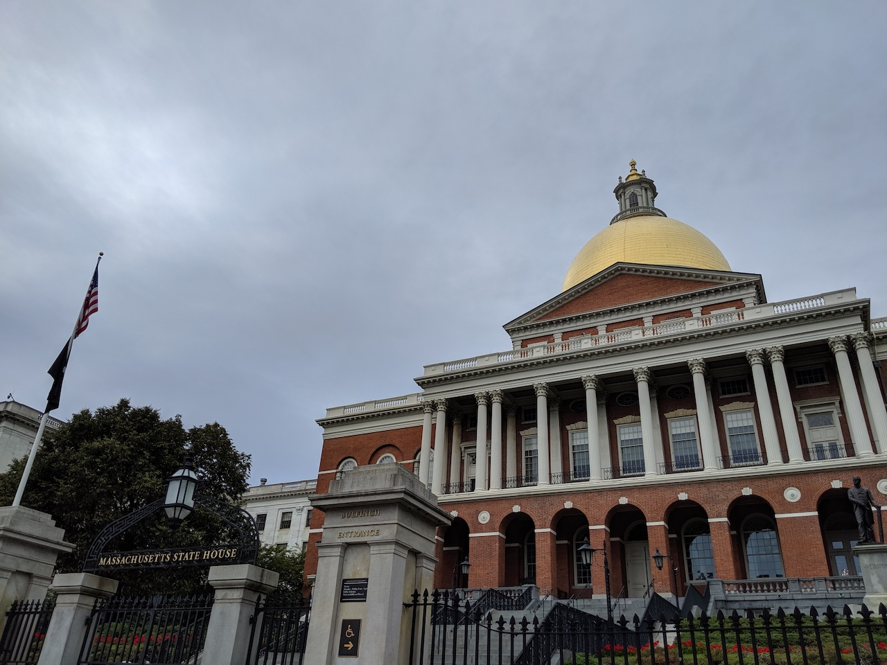
    <figcaption>Boston Common / Massachusetts State House</figcaption>
</figure>

<figure class="half">
    
    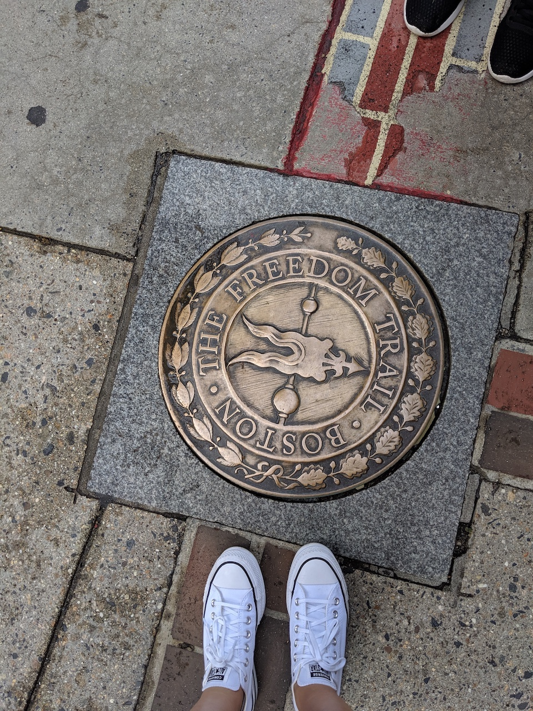

    <figcaption>Park Street Church / Freedom Trail </figcaption>
</figure>

## 波士頓公共花園 (Boston Public Garden)

從 Boston Common 多走幾個路口就會到波士頓公共花園，現在的公園直到1800初還是泥灘，後來才慢慢開始填土成陸地，花園在1837年完成。

<figure class="half">
    
    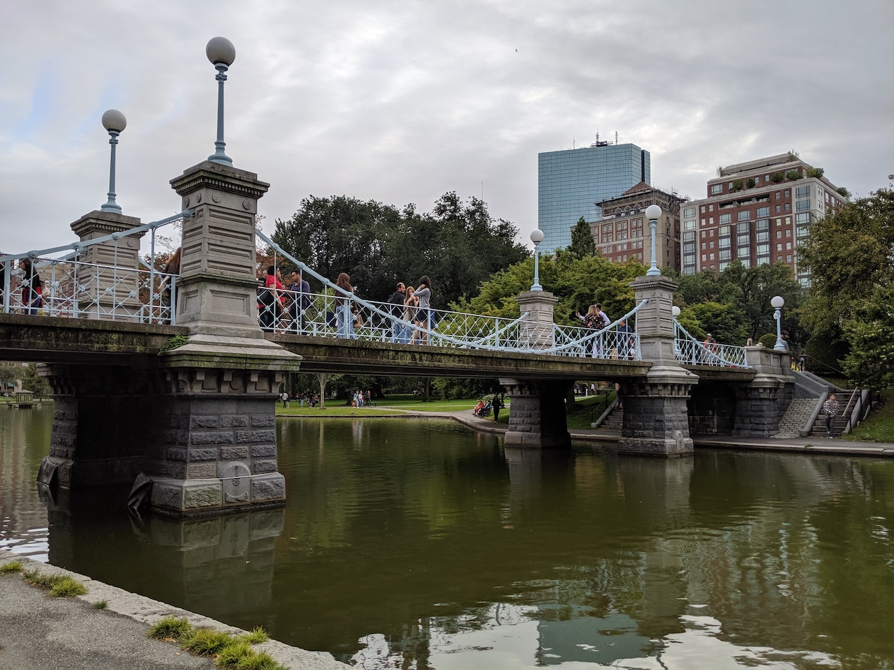
</figure>

<figure class="half">
    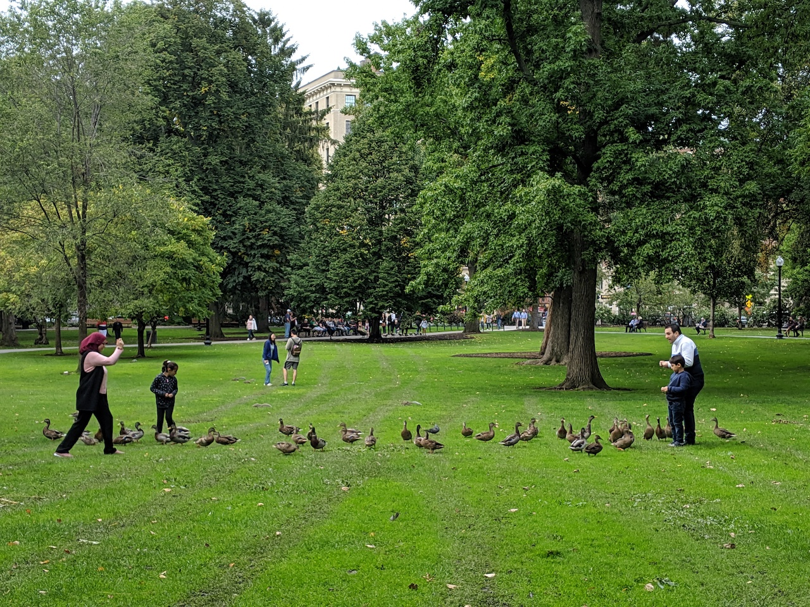
    
</figure>

公園內有一個大湖，佔地4 acres (16,000 m2)，是鴨子和天鵝們的家，可以搭乘天鵝船觀光，但當天不知是天氣不好還是太晚，沒看到有遊客在搭船。
[Swan Boats](https://swanboats.com/)

公園內也有很多有名的雕像，在 Arlington Street gate 那端有著名的 equestrian statue of George Washington
<figure class="half">
    
    
</figure>

在 Charles and Beacon streets entrance 的著名雕像是出自於童話書 Make Way for Ducklings 的小鴨雕像

<figure>
    
</figure>

## 昆西市場 (Quincy Market)

昆西市場位於市中心，離 Faneuil Hall不遠，當初建造昆西市場是為了擴大Faneuil Hall的商業需求。建於1824年，以建造昆西市場的市長 Josiah Quincy 命名，為19世紀上半美國最大的市場建築之一。
<figure>
    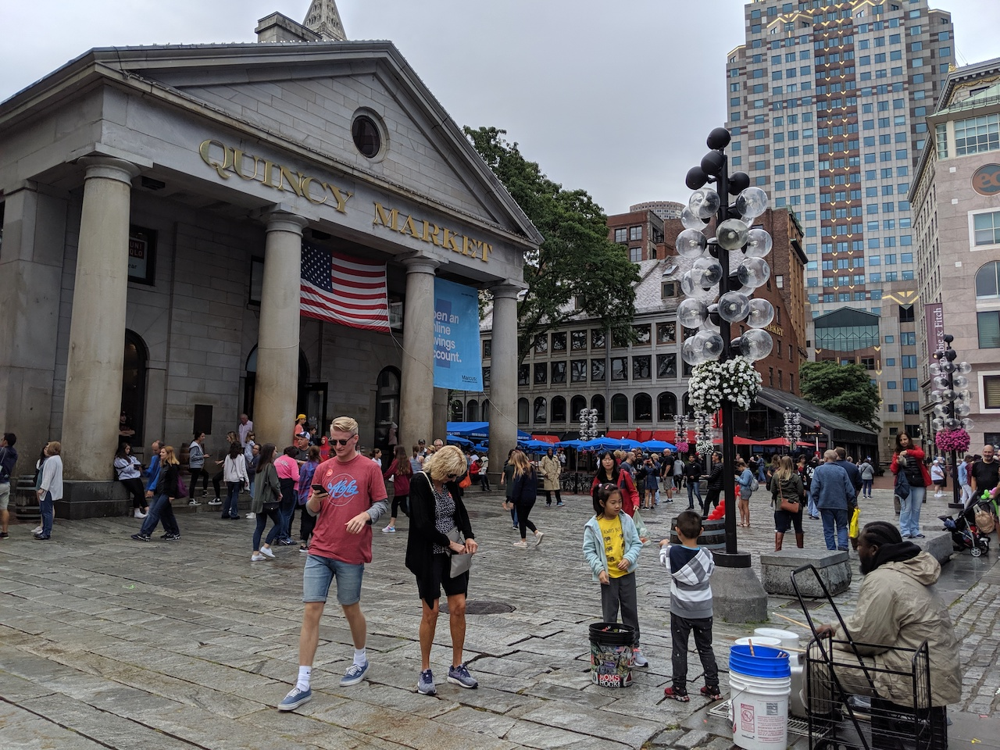
</figure>

由 Alexander Parris 設計，昆西市場共有兩層樓，有點像美食街，很長的美食街，總長 535 feet (163 m)，一樓是攤販區，二樓是座位區

<figure>
    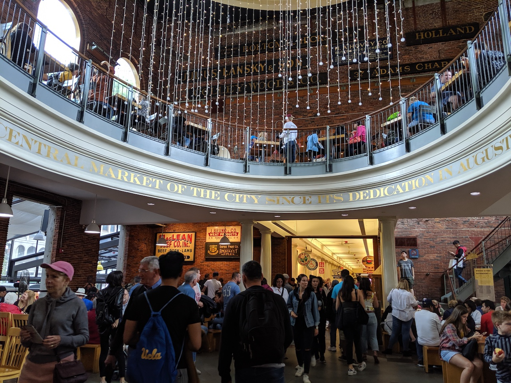
    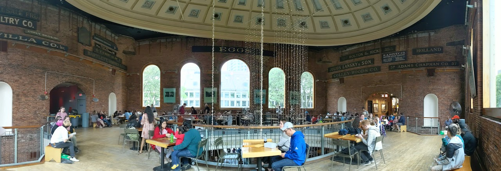

    <figcaption>昆西市場內部 </figcaption>
</figure>

昆西市場周遭有很多小攤販和店家，很適合逛街:)

<figure class="half">
    

    <figcaption>昆西市場外部 </figcaption>
</figure>

可愛的大茶壺星巴克
<figure>
    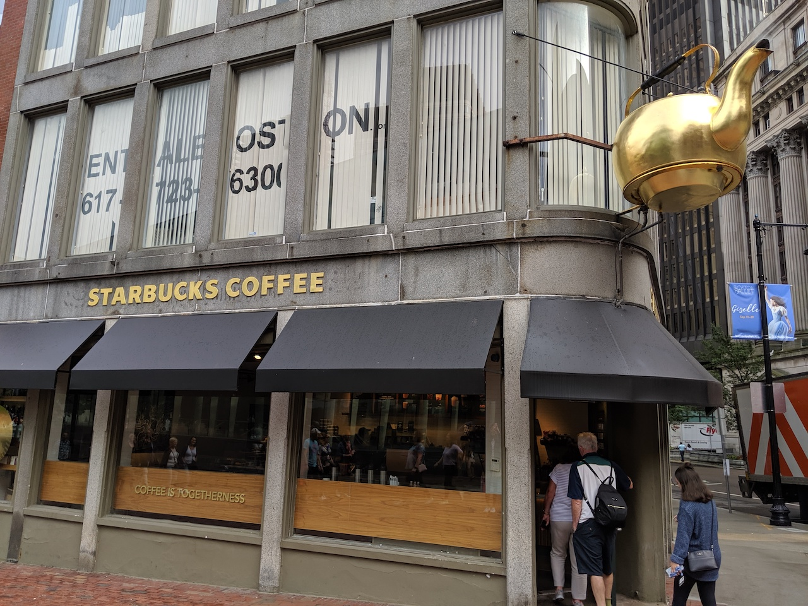
</figure>

---
## 尋找美食

- Pauli's - 65 Salem St, Boston, MA 02113
Lobster roll！！滿滿的龍蝦～但價格不菲，這樣小小一個要20鎂
<figure class="half">
    
</figure>

- Mount Vernon Restaurant & Pub - 14 Broadway, Somerville, MA 02145

想吃cp值超高的龍蝦就要來這！！兩隻大龍蝦才22鎂(歡呼聲)
他們的龍蝦是整隻下去煮，沒幫你切開，所以在吃的時候超嫩超多汁。
還有一顆1 dollar的生蠔！相較於厲害的生蠔店他就小顆很多，但才1塊錢沒什麼好挑惕的哈哈，很新鮮很好吃。
<figure class="half">
    
    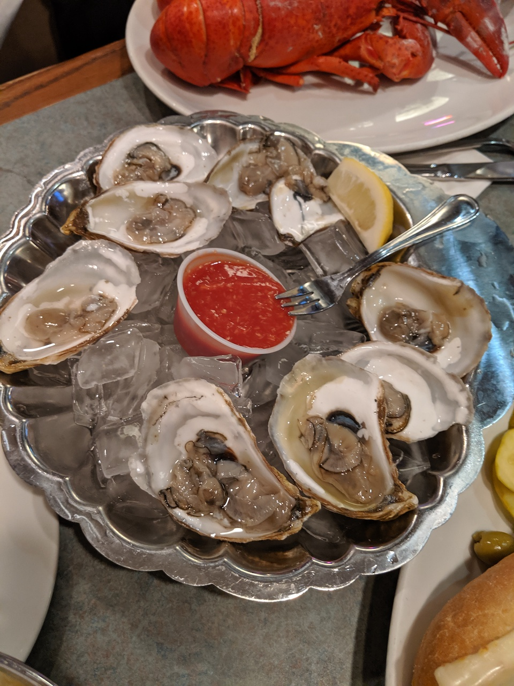
</figure>
