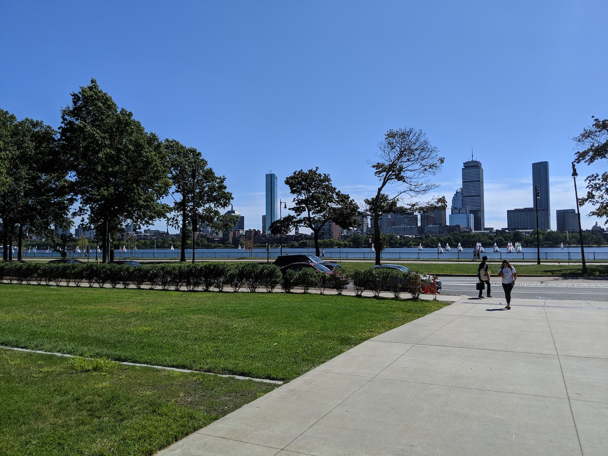

> 龍蝦之旅 -- 初訪波士頓 Part2

第二天是校園之旅

講到波士頓，絕對會想到兩所神之學校 - *哈佛* 和 *麻省理工學院*

## 交通

這兩所學校位於 Cambridge，與Boston隔著 Charles River，從Boston Downtown開車大概10分鐘車程。兩間學校也都可以搭紅線T地鐵到達，哈佛在Harvard Square 站，MIT Kendall/MIT 站。

## Harvard University

<figure>
    
</figure>

踏進夢幻學校哈佛，內心真的是波濤洶湧，書香氣息都來了，跟著覺得自己都變聰明了哈哈哈，這輩子考不上的學校就來好好逛逛吧！

首先來到的是歷史重鎮，全哈佛最古老的區 - Harvard Yard，看哈佛雕像跟圖書館

John Harvard Statue，他有個稱呼是"[statue of three lies](https://www.summer.harvard.edu/inside-summer/3-lies-harvard)"，因為刻在雕像上面的介紹是錯的！ How?!
1. 他不是 John Harvard 本人
    雕像建於1884年，但哈佛死於1638年，而當時無法找到任何一個哈佛的畫像，所以就找了一位模特兒(Sherman Hoar)
2. John Harvard 並不是哈佛大學的創辦人
    雕像上寫他是founder但其實他是贊助者，他捐了一半的財產以及他的藏書，超過400本
3. 哈佛大學不是建於1638年
    很接近但是哈佛大學其實建於1636年

傳說摸他的左腳會考好運喔～看他閃亮的左腳就知道了
<figure class="half">
    
    
    <figcaption>John Harvard Statue</figcaption>
</figure>

哈佛雕像後面的建築很美，文青一下

<figure>
    
</figure>

走著走著就會到哈佛圖書館，可惜只有哈學生才能進去啊，只好在門口合照一下

<figure class="half">
    
    <figcaption>Harry Elkins Widener Memorial Library</figcaption>
</figure>

之後就在這個大學城晃晃

劇院定期會有表演，可上官網看演出日期購票
<figure>
    
    <figcaption>Sanders Theater</figcaption>
</figure>

哈佛法學院

<figure>
    
    <figcaption>Harvard Law School</figcaption>
</figure>

Harvard Square，地鐵站和校園附近的商店聚集處，學生活動的主要場所，可惜時間不夠沒辦法好好逛逛
<figure>
    
</figure>

哈佛書店/紀念品店，文青！
<figure>
    
</figure>

-----

## Massachusetts Institute of Technology

身為一個科技宅宅夢想之一就是進超強理工名校MIT就讀啊！！！但當時連想都不敢想好像也沒申請，跟哈佛古色古香的校風相比，MIT完全是另外一種風格，Modern & Crazy 哈哈，有很多著名的建築，我超愛，感覺在這裡唸書很幸福！

很有趣的fun fact MIT裡面的大樓，教室，實驗室等等都是用數字做為代號，真不愧是理工學院XD

MIT Great Dome
MIT的地標，位於學校的中心點，怎麼可以美成這樣！！！
<figure>
    
</figure>

另一邊看過去就是 Charles River 和 Boston

<figure>
    
</figure>

內部可以看到長長的走廊，叫做 Infinite Corridor，入口旁邊可以看到MIT校徽，這條走廊直接通道 Great Dome的另一邊，走起來真的是感到Infinite呢...

<figure class="half">
    
    
</figure>

史塔特科技中心 Ray and Maria Stata Center (Building 32)，由 Frank Gehry 設計的，是我最喜歡的一棟建築
<figure>
    
</figure>

再來是世界級大師貝聿銘設計的 Wiesner building (Building E15)，也是大名鼎鼎的 MIT Media Lab所在地

<figure>
    
</figure>

Green Building (Building 54)，也是貝聿銘大師的傑作，建於1962–1964年，是貝聿銘第一次承接的波士頓建築，這棟建築有18樓，相當於21層樓高，這棟混凝土建築在當時是一大創舉因為那時候混凝土技術還在試驗階段，綠樓建好後，也被波士頓居民評為當年最美建築！

Fun fact: 旋轉門的奧秘
後來發現由於風力阻礙，大樓大門有時候打不開，最後加上了旋轉門才解決問題。至於旋轉門用途請自行google
<figure class="half">
    
</figure>

時間也是才匆匆去匆匆，MIT還有很多有名的設計沒看到，希望有機會再來！

<figure>
    
</figure>

## 晚餐

- Island Creek Oyster Bar - 500 Commonwealth Avenue, Boston, MA 02215

這間高級餐廳雖然價錢偏貴，一顆大概4-5鎂，但是這裡的生蠔真的超大顆超新鮮！走進餐廳就看到滿滿的一排 Oyster Bar！有各地來的生蠔，選擇很多，雖然我吃不太出來區別....哈哈哈
<figure class="half">
    
    
</figure>
