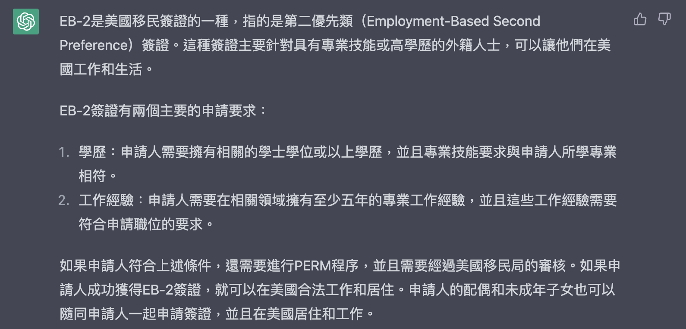

記錄一下自己申請綠卡的經驗，過程真的很有點冗長又瑣碎啊～

PERM ➡️ I-140 ➡️ AOS

~~EB-2通常是透過雇主幫員工申請的...~~ ChatGPT當道！什麼是EB-2呢？

<figure>
    
</figure>

## PERM 

PERM(Program Electronic Review Management) 應該是申請EB-2綠卡最久的一個階段，因為要經過移民局的各種審核，我的律師會請我提供:

1. 目前工作的相關資料
- 包括工作內容，職責，所需的技術知識
- 列出來的技術都必須有過去的經驗證明

2. Manager letter
- 當初申請的時候工作經驗不滿兩年，所以律師也擬了一份稿請我的manager證明我的經驗

3. 歷年的工作經驗證明
- 我聯絡前公司的hr部門請他們開工作證明給我

Timeline: 

- 05/24/2021 PERM recruitment period started.
- 08/04/2021 Recruitment completed. Drafting of PERM application in progress.
- 09/02/2021 Case filed with DOL （遞交PERM的日期就是 priority date)
- 04/01/2022 Audit notice received from DOL
- 04/29/2022 Audit response submitted to DOL
- 06/14/2022 Client notified of approval

經歷漫長的等待，我的PERM終於過了！

## I-140

PERM 一過了之後律師就馬上開始準備I-140。大該花了一個月的準備時間。我有請律師幫我申請Premium process，兩個禮拜就批准了！

Timeline: 
- 07/20/2022 Case filed with USCIS
- 08/03/2022 Client notified of approval

## I-485 Adjustment of Status (AOS)
因為有旅遊計畫回了台灣一趟，我沒有申請 I-140, I-485的Concurrent file。I-485的文件繁瑣，建議要一起申請的人趁著丟出140前就回臺灣把以下東西都準備好！律師先發了一個問卷要填所有個人資料，

所需文件
- 出生證明 (正本 + 英文譯本)
網路上出生證明眾說紛紜..有些人交戶籍謄本，戶政事務所出生證明，醫院出生證明，所以我自己是全部都準備了。但我沒有申請醫院的因為不是政府機構，也聽說被RFE機率很高。
    - 戶政事務所申請中英文的戶籍謄本，自己的和整戶的，記得要有整戶的因為要核對父母名字和地址。
    - 戶政事務所申請中文的出生證明(沒有英文版)，然後自己翻譯一份英文的拿去公證
- 結婚證明 (正本 + 英文譯本)
- 離婚/死亡證明 (正本 + 英文譯本)
- I-94
- 護照
    - 所有歷年護照，包括過期的，整本都要掃描一份
- 所有移民相關的文件
    - I-797, I-20, EAD....
- 照片 x 6 (寄給律師)
- 移民體檢 (寄給律師)
    - 要去找有在做移民體檢的醫生幫我抽血補打疫苗，總共去了兩次。
    1. 帶著疫苗證明去找醫生，抽血後，等報告出來醫生會告訴我要補打哪些。我打了flu, Hepatitis B, Tdap挨了三針XD
    2. 帶著補打疫苗證明，確認需要的疫苗都打了，醫生現場跟我一起填I-693表格，一起核對然後彌封
    - 把表格和照片一起寄給律師，跟著I-485一起送出

最後總共有3或4個表格配偶跟本人都要親自檢查簽名
I-485, I-131, I-765, I-485 Supplement J (配偶不會有J表格)，一定要認真檢查！！！我有發現律師填錯我的I-94資料還有國籍... 

Timeline: 
- 01/30/2023 Case filed with USCIS
- 02/28/2023 Receipt notice received from USCIS
- 03/06/2023 I-485 Supplement J Receipt Notice received

- 03/07/2023 Biometric appointment notice received from USCIS
- 03/15/2023 Fingerprints received
- TBD

先更新到這拉～先更新到這拉～